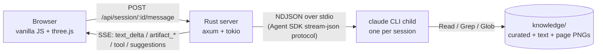

# Vulcan OmniPro 220 — Technical Expert

A multimodal support agent for the [Vulcan OmniPro 220](https://www.harborfreight.com/omnipro-220-industrial-multiprocess-welder-with-120240v-input-57812.html) multiprocess welder, built for the [Prox engineering challenge](https://github.com/prox-technologies/prox-challenge).

The agent answers deep technical questions grounded in the 48-page owner's manual, and it answers them multimodally: it embeds the exact manual page, focuses a live 3D model of the machine on the socket you need, draws SVG diagrams, and generates interactive artifacts (duty-cycle calculators, troubleshooting flowcharts, settings configurators) that render in a sandboxed runtime as they stream.

The backend is a native Rust implementation of the Claude Agent SDK client protocol. No Node.js runs at serve time.

## Quick start

```bash
git clone <this-fork>
cd prox-challenge
cp .env.example .env   # put your ANTHROPIC_API_KEY in it
./run.sh               # → http://localhost:8317
```

`run.sh` does two things: `npm install` (fetches the Agent SDK's vendored `claude` binary — the only reason npm is involved) and `cargo run --release`. Requires Rust ([rustup.rs](https://rustup.rs)) and Node 18+.

No key in `.env`? The backend falls back to your local `claude` CLI login if you have one.

## Architecture



The Claude Agent SDK's TypeScript and Python packages are thin clients: they spawn the `claude` CLI and exchange newline-delimited JSON over stdio. This project implements that client natively in Rust (`server/src/protocol.rs`, `stream.rs`, `agent.rs`). The CLI child runs with `--print --input-format stream-json --output-format stream-json --include-partial-messages`, its working directory set to `knowledge/`, and its tools restricted to `Read`, `Grep`, `Glob`. The Rust server:

1. Spawns one long-lived CLI child per browser session and streams user turns to its stdin.
2. Parses the token-level event stream and re-emits it to the browser over SSE.
3. Runs an incremental parser over the text stream that recognizes `<antArtifact>` blocks (the tag format Claude is trained on) and splits them out of the prose into separate artifact events — so an artifact starts rendering in the UI while the model is still writing it.
4. Watchdogs every turn: if the child goes silent for 120 s the browser gets an error event and a Retry button, and the session stays usable.

`Read` is multimodal. When a question hinges on a diagram, the agent opens the rendered page PNG and looks at it. Ask about the wiring schematic and it reads `pages/owner-manual-p45.png` with its own vision, not a lossy text extraction.

## Knowledge extraction

`knowledge/` is a committed, pre-extracted corpus. Nothing is parsed at runtime.

| Layer | Contents | Why |
|---|---|---|
| `pages/` | Every page of all three PDFs rendered to PNG (150 DPI; the selection chart at 300 DPI plus a 3×3 crop grid) | The agent's eyes: schematics, duty-cycle clock diagrams, defect illustrations |
| `text/` | Full per-page text with verified markdown tables, plus transcribed figure notes for every graphics-heavy page | Fast Grep targets |
| `curated/` | 11 hand-verified files (specs, duty-cycle, per-process setup, settings charts, troubleshooting, wire feed, parts, safety). Every fact carries a `[owner-manual p.N]` citation | The agent's primary source; retrieval-shaped, citation-first |
| `manifest.json` | Per-page topics, figures, and critical flags for all 51 pages | The agent's map of what lives where |

Extraction notes that mattered:

- The selection chart PDF has **no text layer at all** — it is a flattened image. Its process-comparison table, MIG-vs-flux-cored checklist, and duty-cycle example were transcribed by vision from high-DPI crops. Cells that stayed illegible are marked illegible, not guessed.
- The IEC rating nameplate (repeated on four pages) extracts in a scrambled reading order that appears to contradict the p.7 specifications table. Every block was cross-matched against p.7; all six process/voltage blocks agree exactly, and `curated/specs.md` records the resolved mapping.
- Duty-cycle values exist in three independent places (specs table p.7, clock diagrams p.19/p.29, nameplate). All three were cross-checked and agree: MIG at 240 V is 25% at 200 A.

## Multimodal responses

- **Manual figures**: the agent embeds the actual page image at the point in the answer where you need to look at it, and citations like `[manual p.24]` deep-link to the original PDF at that page (`/files/owner-manual.pdf#page=24`).
- **3D machine view**: a stylized OmniPro 220 built in three.js with nine named hotspots (sockets, polarity terminals, wire feed, tension knob, spool, panel, power switch, gas inlet). When the agent needs to point at the machine — "which socket does the ground clamp go in?" — it emits a `machine-view` artifact and the camera tweens to the target with a pulsing highlight and label.
- **Interactive artifacts**: Mermaid flowcharts, self-drawn SVG diagrams, and React components (duty-cycle calculator, settings configurator) stream into sandboxed iframes (`sandbox="allow-scripts"`, opaque origin, 5 s render watchdog). React artifacts run through Babel with an esm.sh import map (React 18, recharts, lucide-react); all table data inside an artifact is hardcoded from the manual with page citations visible in the UI.
- **Weld photo diagnosis**: upload a photo of your bead; the agent reads it, compares against the manual's defect illustrations (p.35–40), names the defect, and gives the causes/fixes from the troubleshooting matrix.
- **Voice**: dictation in (Web Speech API) and optional spoken answers out, sentence-by-sentence as the response streams. Both browser-native, zero API cost.

## Hard questions to try

- "What's the duty cycle for MIG welding at 200A on 240V?" — exact answer with the p.19 clock diagram embedded and the 2.5 min weld / 7.5 min rest breakdown.
- "What polarity setup do I need for TIG? Which socket does the ground clamp go in?" — TIG is the reverse of Stick (ground clamp → **positive** socket); the 3D machine focuses the socket and the p.24 diagram is embedded.
- "I'm getting porosity in my flux-cored welds. What should I check?" — troubleshooting matrix row plus the flux-core polarity gotcha (DCEN, opposite of MIG), usually with a flowchart artifact.
- "Walk me through the wiring schematic." — the agent reads the schematic PNG with vision and explains the AC → PFC → IGBT inverter → transformer → output topology.
- Ask an underspecified question ("what settings should I use?") — it asks one clarifying question instead of guessing.

## Design decisions

- **Native Rust harness instead of the Node SDK.** The SDK's value is the CLI's agent runtime and its wire protocol, both of which are stable and documented by the SDK's own source. Speaking the protocol directly from Rust removes the Node middleman from every request, keeps one static binary serving HTTP, SSE, and process supervision, and makes illegal protocol states unrepresentable in the type system (`server/src/protocol.rs`).
- **Curated corpus over RAG.** 48 pages fit in a grep-able, citation-first corpus. No vector store, no embedding drift, no retrieval misses on safety-critical numbers. The model looks facts up the way a technician does: in the indexed manual.
- **In-band artifacts over tool calls.** Claude is trained on the `<antArtifact>` format. Parsing it out of the token stream means artifacts render progressively instead of arriving all at once after a tool round-trip.
- **Failure is a first-class state.** Turn watchdog, SSE error events, inline Retry, session auto-respawn on a dead child. (We probed a production agent in this product category that hangs forever with a spinner when asked for a diagram. This one degrades loudly instead.)

## Repo tour

```
server/            Rust crate — axum server + native Agent SDK protocol client
web/               index.html, app.js, style.css, machine.js (three.js), artifact-shell.html
knowledge/         extracted corpus: pages/, images/, text/, curated/, manifest.json
prompts/system.md  the agent's system prompt: grounding rules, artifact conventions, figure index
files/             original PDFs (served for citation deep-links)
run.sh             setup + run
```

## Configuration

| Variable | Default | Purpose |
|---|---|---|
| `ANTHROPIC_API_KEY` | — | API auth (`.env`); falls back to local `claude` login if unset |
| `VULCAN_PORT` | `8317` | HTTP port |
| `VULCAN_MODEL` | `sonnet` | Model alias passed to the CLI |
| `VULCAN_TURN_MODE` | `keepalive` | `resume` spawns a fresh child per turn instead |
| `CLAUDE_BIN` | auto | Explicit path to a `claude` binary (otherwise: vendored → PATH) |
